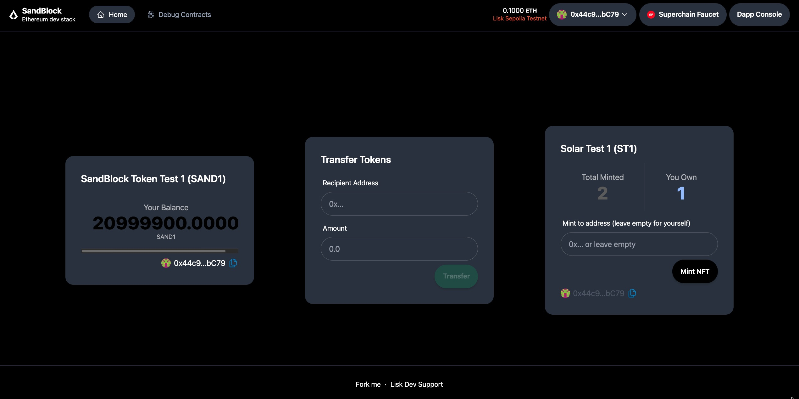
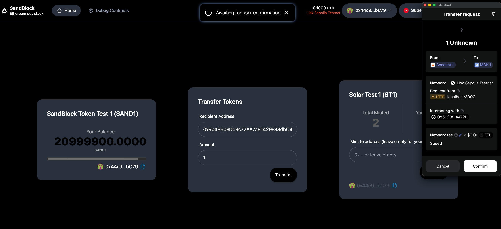
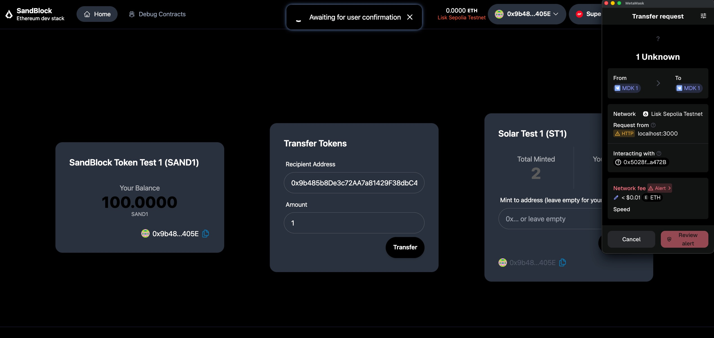
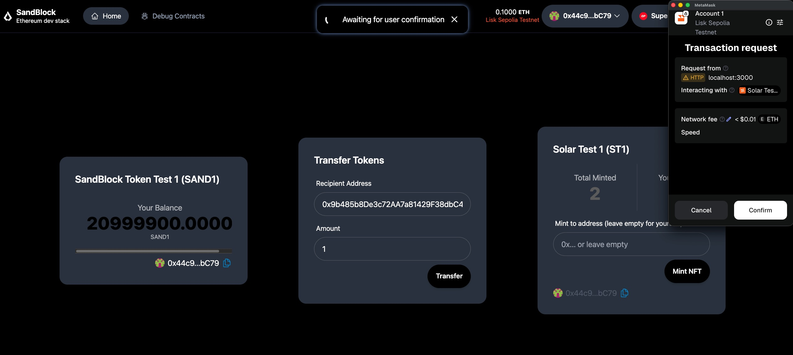
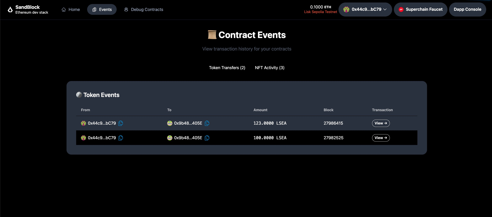
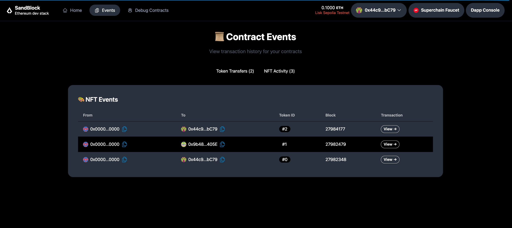

<h1>Lisk Onboarding Challenge</h1>

This repo is a fork of **[Scaffold-Lisk](https://github.com/LiskHQ/scaffold-lisk)**. Following Scaffold-Lisk guideline, we create and deploy smart contracts (ERC-20 and ERC-721) and build a simple user interfaces that interact with our contracts.

⚙️ Built using NextJS, RainbowKit, Hardhat, Wagmi, Viem, and Typescript.

## Requirements

- [Node (>= v18.17)](https://nodejs.org/en/download/)
- Yarn ([v1](https://classic.yarnpkg.com/en/docs/install/) or [v2+](https://yarnpkg.com/getting-started/install))
- [Git](https://git-scm.com/downloads)

<h2>Week 1: Hello Token + NFT</h2>

## Deploy ERC20 Token and ERC721 NFT contracts to Lisk Sepolia testnet

After update `./packages/hardhat/.env` to setup `DEPLOYER_PRIVATE_KEY`, we deploy smart contracts with `yarn deploy --network liskSepolia`. It cost [0.000000621789 ETH](https://sepolia-blockscout.lisk.com/tx/0xe36b73cb2ba7555d9770b9b210c434173bf84aee0ce846e74b0f589ec34982a2) for our ERC-20 contract and [0.000001156845 ETH](https://sepolia-blockscout.lisk.com/tx/0x1cf9010f72d8972c9758f7d0cde5beeaddaccb591f4123946d507437411f37f4) for our ERC-721 contract (Gas fee).

<div align="center" style="margin-top: 24px;">
  
</div>

- Our ERC-20 contract: [SandBlock Token Test 1](https://sepolia-blockscout.lisk.com/address/0x5028f11E8d53Eefb58b44D0E2533cE6B2E6a472B)
- Our ERC-721 contract: [SandBlockNFT](https://sepolia-blockscout.lisk.com/address/0xb2cFA4aeF963C003f5Cbc057bBDe75F1dAfD09AE)

## Verify contracts

Using Hardhat

```
yarn hardhat-verify --network liskSepolia --contract contracts/SandBlockToken.sol:SandBlockToken 0x5028f11E8d53Eefb58b44D0E2533cE6B2E6a472B
yarn hardhat-verify --network liskSepolia --contract contracts/SandBlockNFT.sol:SandBlockNFT 0xb2cFA4aeF963C003f5Cbc057bBDe75F1dAfD09AE
```

<div align="center" style="margin-top: 24px;">
  
</div>

<div align="center" style="margin-top: 24px;">
  
</div>

<h2>Week 2: Frontend Connect</h2>

## Build ERC-20 Token & NFT Interface (Using DaisyUI)

Home UI: Show token ballance, transfer token and mint NFT

<div align="center" style="margin-top: 24px;">
  
</div>

Transfer ERC-20 Token

<div align="center" style="margin-top: 24px;">
  
</div>

<div align="center" style="margin-top: 24px;">
  
</div>

Mint NFT

<div align="center" style="margin-top: 24px;">
  
</div>

<h2>Week 3: Display Contract Events & Transaction History</h2>

ERC-20 events:

<div align="center" style="margin-top: 24px;">
  
</div>

NFT events:

<div align="center" style="margin-top: 24px;">
  
</div>